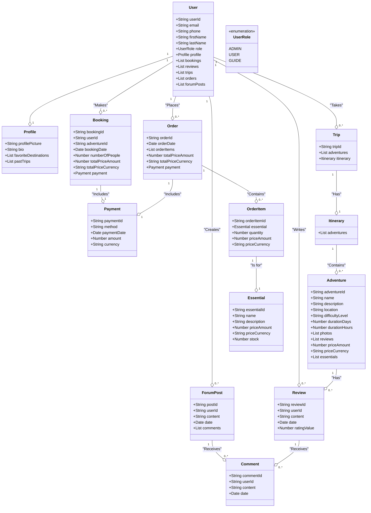

# Aventura: Ultimate Hub for Thrill Seekers and Adventurers

## Project Overview

The "Aventura" project aims to provide a holistic platform for adventure enthusiasts, offering a wide range of features to enhance their adventure planning, booking, and community engagement experiences. From detailed adventure listings and user reviews to itinerary planning and safety support, the platform is designed to cater to all aspects of adventure travel, ensuring users have a memorable and fulfilling experience.

## Key Features

### User Profiles

#### User Registration and Authentication

- Users can create accounts, log in, and manage their profiles securely.

#### Profile Customization

- Users can personalize their profiles with profile pictures, bios, and favorite destinations.

### Adventure Listings

#### Adventure Database

- A comprehensive and regularly updated database of various adventure activities and destinations.

#### Filter and Search

- Advanced filtering options, including difficulty level, duration, location, and activity type, along with robust search functionality to help users find the perfect adventure.

#### Detailed Listings

- Each adventure listing includes in-depth information, high-quality photos, interactive maps, detailed itineraries, weather forecast for destinations, difficulty ratings, and user reviews.

### Reviews and Ratings

#### User Reviews

- Users can write detailed reviews, rate adventures, to share their experiences.

#### Rating System

- An overall rating system for treks and activities based on user reviews, helping other users make informed decisions.

#### Comment and Reply

- Users can comment on reviews, fostering a community discussion and engagement.

### Booking and Reservations

#### Online Booking

- Users can book guided tours and adventure activities directly through the platform, simplifying the reservation process.

#### Availability Calendar

- Real-time availability of slots for various activities, ensuring users can find and book their desired adventures.

#### Payment Integration

- Secure payment gateways for booking and reservations, ensuring a seamless and secure transaction experience.

### Blogs and Community Features

- Expert Tips and Articles: Articles and tips from adventure experts and seasoned trekkers, offering valuable insights and advice.
- Eco-Friendly Tips: Tips and guidelines for sustainable and eco-friendly travel, promoting responsible tourism.
- Forums and Discussion Boards: A space for users to discuss adventures, share tips, and ask for advice, creating a supportive community.

### Website Features

- Notifications: Receive booking email confirmations.

### Essentials Store

#### Essential Items Management

- Users can browse products with options to filter by category, price, and ratings.

#### Product Listings

- Detailed listings for each essential item, including name, description, price, and stock availability.

#### Order and Payment Integration

- Users can add essential items to the cart, manage quantities, and proceed to checkout.Complete the purchase with a secure payment gateway using Stripe.Track orders and view order history.

## Object Domain Model (Mermaid Code)

## REST API resources

### Users
    • GET /users: Retrieve a list of users
    • POST /users: Create a new user
    • GET /users/{userId}: Retrieve a specific user by ID
    • PUT /users/{userId}: Update a specific user by ID
    • DELETE /users/{userId}: Delete a specific user by ID

### Tours
    • GET /packages: Retrieve a list of trips
    • POST /packages: Create a new trip
    • GET /packages/{packageId}: Retrieve a specific trip by ID
    • PUT /packages/{packageId}: Update a specific trip by ID
    • DELETE /packages/{packageId}: Delete a specific trip by ID
### Orders
    • GET /products: Retrieve a list of orders
    • POST /products: Create a new order
    • GET /products/{productId}: Retrieve a specific order by ID
    • PUT /products/{productId}: Update a specific order by ID
    • DELETE /products/{productId}: Delete a specific order by ID
### Blogs
    • GET /blogs: Retrieve a list of forum posts
    • POST /blogs: Create a new forum post
    • GET /blogs/{blogId}: Retrieve a specific forum post by ID
    • PUT /blogs/{blogId}: Update a specific forum post by ID
    • DELETE /blogs/{blogId}: Delete a specific forum post by ID

## External APIs
    https://docs.mapbox.com/
    https://stripe.com/docs/payments
    https://openweathermap.org/guide
    https://recharts.org/en-US/guide
    https://www.emailjs.com/
    

## Instructions to use the repo

    You can clone the repo by using HTTP:

    https://github.com/info-6150-summer-2024/final-project-web-wizards.git

    OR set up the SSH Key using: git@github.com:SharanKumarPrabhakaran/Aventura.git

    Commands to use:

    git clone <use HTTP Link or SSH Link>

## Contributers

    Name   : Sharan Kumar Prabhakaran
    NUID   : 002831828
    Email  : prabhakaran.sh@northeastern.edu

