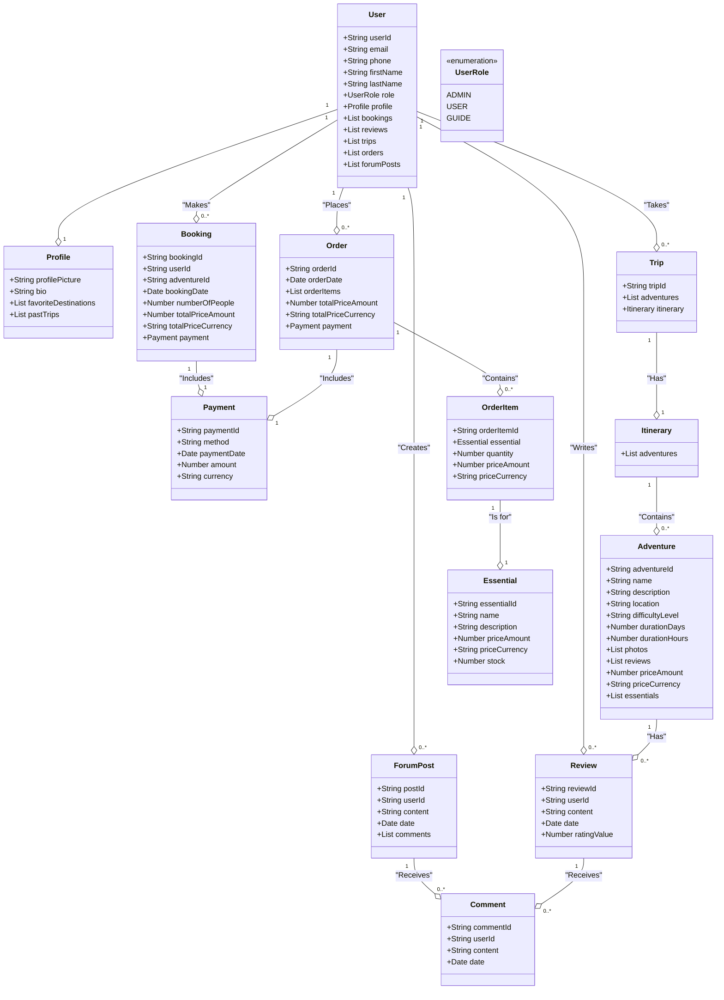

## Domain Modal (Mermaid Code)

```mermaid
classDiagram
  direction TB

  class User {
      +String userId
      +String email
      +String phone
      +String firstName
      +String lastName
      +UserRole role
      +Profile profile
      +List<Booking> bookings
      +List<Review> reviews
      +List<Trip> trips
      +List<Order> orders
      +List<ForumPost> forumPosts
  }

  class UserRole {
<<enumeration>>
      ADMIN
      USER
      GUIDE
  }

  class Profile {
      +String profilePicture
      +String bio
      +List<String> favoriteDestinations
      +List<Trip> pastTrips
  }

  class Adventure {
      +String adventureId
      +String name
      +String description
      +String location
      +String difficultyLevel
      +Number durationDays
      +Number durationHours
      +List<String> photos
      +List<Review> reviews
      +Number priceAmount
      +String priceCurrency
      +List<Essential> essentials
  }

  class Review {
      +String reviewId
      +String userId
      +String content
      +Date date
      +Number ratingValue
  }

  class Booking {
      +String bookingId
      +String userId
      +String adventureId
      +Date bookingDate
      +Number numberOfPeople
      +Number totalPriceAmount
      +String totalPriceCurrency
      +Payment payment
  }

  class Payment {
      +String paymentId
      +String method
      +Date paymentDate
      +Number amount
      +String currency
  }

  class Trip {
      +String tripId
      +List<Adventure> adventures
      +Itinerary itinerary
  }

  class Itinerary {
      +List<Adventure> adventures
  }

  class Essential {
      +String essentialId
      +String name
      +String description
      +Number priceAmount
      +String priceCurrency
      +Number stock
  }

  class Order {
      +String orderId
      +Date orderDate
      +List<OrderItem> orderItems
      +Number totalPriceAmount
      +String totalPriceCurrency
      +Payment payment
  }

  class OrderItem {
      +String orderItemId
      +Essential essential
      +Number quantity
      +Number priceAmount
      +String priceCurrency
  }

  class ForumPost {
      +String postId
      +String userId
      +String content
      +Date date
      +List<Comment> comments
  }

  class Comment {
      +String commentId
      +String userId
      +String content
      +Date date
  }

  User "1" --o "1" Profile
  User "1" --o "0..*" Booking: "Makes"
  User "1" --o "0..*" Review: "Writes"
  User "1" --o "0..*" Trip: "Takes"
  User "1" --o "0..*" Order: "Places"
  User "1" --o "0..*" ForumPost: "Creates"
  Adventure "1" --o "0..*" Review: "Has"

  Booking "1" --o "1" Payment: "Includes"
  Trip "1" --o "1" Itinerary: "Has"
  Itinerary "1" --o "0..*" Adventure: "Contains"
  Order "1" --o "1" Payment: "Includes"
  Order "1" --o "0..*" OrderItem: "Contains"
  OrderItem "1" --o "1" Essential: "Is for"
  ForumPost "1" --o "0..*" Comment: "Receives"
  Review "1" --o "0..*" Comment: "Receives"
```
